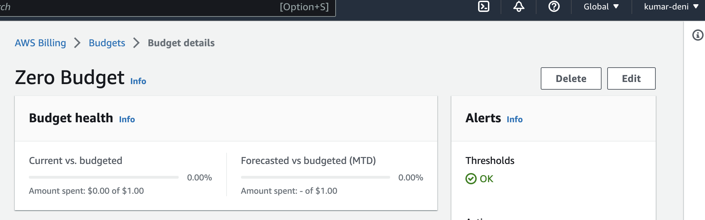
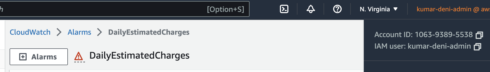
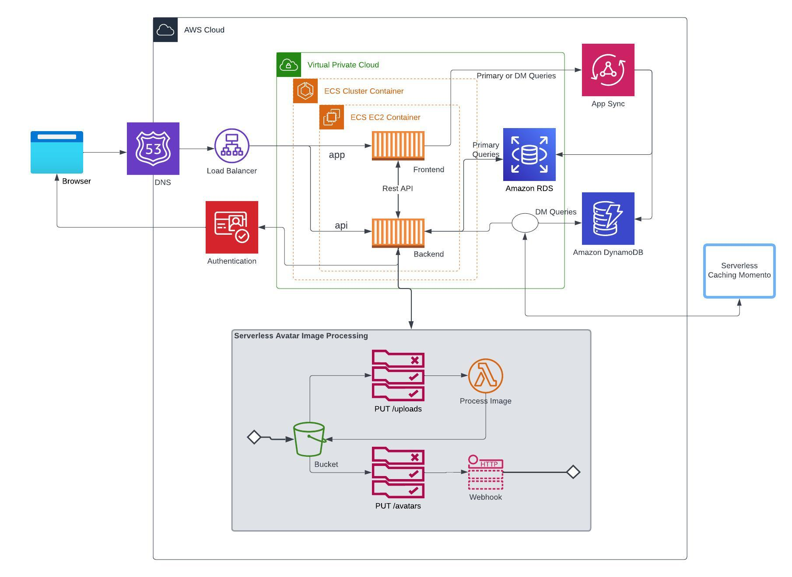

# Week 0 — Billing and Architecture

## Required Homework/Tasks

- Setting up MFA
- Creating an IAM user with AdministratorAccess Policy
- Trying out Cloudshell
- Setting up gitpod.yml to install cli and connect to aws in gitpod
- Creating Budgets, notification and Billing alarm
- Recreating logical diagram in lucid chart

### AWS CLI
Installed using gitpod.yml config

### Budgets and Billing alarm

### Recreate Logical Architecture Design

[link to lucid chart](https://lucid.app/lucidchart/b185bd25-e3ec-456b-a782-6e5c0d3c0596/edit?beaconFlowId=C054D7416075C4CF&invitationId=inv_a5cdd9a4-934d-4a1c-951f-5e62c1cdd5eb&page=0_0#)

## Homework Challenges

